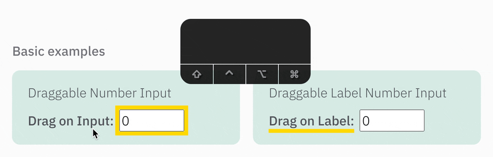

# Draggable Number Input

<a href="https://www.npmjs.com/package/draggable-number-input"></a>

A React component intended to replicate the draggable number input behavior
we see in applications like Blender, Figma, and After Effects.



## [Interactive Docs & Examples](https://brettlyne.github.io/draggable-number-input/) 👈

## Installation

```bash
npm install draggable-number-input
```

## Usage

```jsx
import {
  DraggableNumberInput,
  DraggableLabelNumberInput,
} from "draggable-number-input";

// Basic usage with Draggable Number Input
function MyComponent() {
  const [value, setValue] = useState(0);
  return (
    <label>
      Lucky number:
      <DraggableNumberInput value={value} onChange={setValue} />;
    </label>
  );
}

// Basic usage with Draggable Label
function MyLabelComponent() {
  const [value, setValue] = useState(0);
  return (
    <DraggableLabelNumberInput value={value} onChange={setValue}>
      <strong>Drag me:</strong>
    </DraggableLabelNumberInput>
  );
}
```

## Features

- use pointer lock API to make it possible to drag past the edge of the screen and so your cursor is back on the input when you release the mouse.
- use up and down arrow keys while input is focused to increment and decrement
- allow modifier keys to multiply the increment (modifier keys also apply to arrow keys)
- provide optional sensitivity setting per modifier key to more easily target values (ex: in Figma while holding shift you move by 10s and sensitivity is .5)
- multipliers serve as a "snapping" value while dragging, ie: if you're holding shift you'll move by 10 and snap to the nearest 10
- touch interactions are supported in addition to mouse dragging

## API + Demos

### See [Interactive Docs & Examples](https://brettlyne.github.io/draggable-number-input/)
